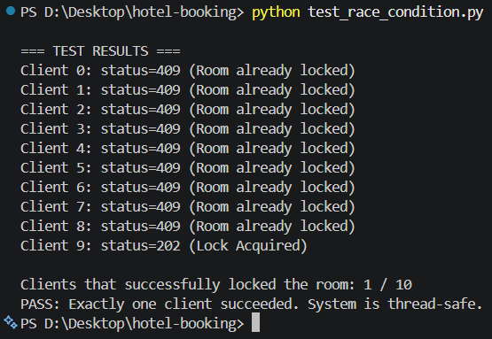
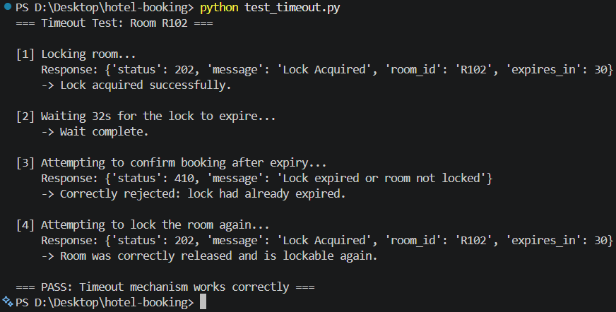

# Hotel Room Booking System with Concurrency Control

A socket-programming project that simulates a real hotel booking system where multiple clients race to book the same room at the same time — and demonstrates how to prevent **double-booking** using a custom TCP protocol, per-resource locking, and automatic timeout handling.

---

## Table of Contents

- [Overview](#overview)
- [Key Features](#key-features)
- [Architecture](#architecture)
- [Protocol Design — HBP](#protocol-design--hbp)
- [Concurrency Design Highlights](#concurrency-design-highlights)
- [Tech Stack](#tech-stack)
- [Project Structure](#project-structure)
- [Getting Started](#getting-started)
- [Usage Example](#usage-example)
- [Concurrency Testing](#concurrency-testing)
- [Design Decisions & Trade-offs](#design-decisions--trade-offs)
- [Future Improvements](#future-improvements)
- [Author](#author)

---

## Overview

In a real booking platform, many users can try to reserve the same room within milliseconds of each other. Without proper concurrency control, this leads to **race conditions** — the system might accept two conflicting bookings for the same room.

This project implements a minimal but realistic **client-server booking system** over raw TCP sockets, where:

- Multiple clients can connect and interact with the server concurrently.
- Only **one client** can successfully lock/book a given room at a time.
- A room lock automatically expires if not confirmed within a time limit, freeing the room back up.

---

## Key Features

- Custom application-layer protocol (**HBP** — Hotel Booking Protocol) over TCP, using JSON messages
- Multi-threaded server — one thread per client connection
- **Per-room locking** (`threading.Lock`) to prevent race conditions without blocking unrelated rooms
- Automatic lock timeout (`threading.Timer`) with defensive handling of expiry race conditions
- Full terminal-based client with a simple interactive menu
- Automated concurrency tests proving correctness under load

---

## Architecture

```
                
   Client 1 ──▶ 
                
   Client 2 ──▶      Server     ──▶ In-memory room state
                  127.0.0.1:5000     (R101–R105)
   Client 3 ──▶
                

Transport : TCP (reliable, ordered delivery)
Format    : JSON messages
Threading : 1 thread per client connection (daemon=True)
```

**Why TCP instead of UDP?** Booking data must never be lost, duplicated, or delivered out of order — a booking is a transaction, not a stream. TCP's reliable, connection-oriented delivery fits that requirement; UDP is better suited to throughput-focused, loss-tolerant use cases like video streaming.

---

## Protocol Design — HBP

**HBP (Hotel Booking Protocol)** is a custom protocol built on top of TCP, using JSON-encoded, newline-delimited messages.

### Room State Machine

```
AVAILABLE ──▶ LOCKED ──▶ BOOKED
                 │
             (timeout)
                 ▼
             AVAILABLE
```

### Actions

| Action             | Description                                      |
|--------------------|---------------------------------------------------|
| `SEARCH_ROOM`      | List available rooms (read-only, no state change) |
| `LOCK_ROOM`        | Temporarily lock a room (default: 30s)             |
| `CONFIRM_BOOKING`  | Confirm a booking on a room that is currently locked |
| `CANCEL_LOCK`      | Release a lock, returning the room to `AVAILABLE`  |

### Status Codes

| Code | Phrase                | Meaning                                   |
|------|------------------------|--------------------------------------------|
| 200  | OK                      | General success (e.g. search)             |
| 201  | Booking Confirmed       | Booking completed successfully            |
| 202  | Lock Acquired           | Room successfully locked                  |
| 409  | Room Already Locked     | Another client currently holds the lock   |
| 410  | Lock Expired            | Lock timed out before confirmation        |
| 404  | Room Not Found          | Invalid room ID                           |
| 400  | Bad Request             | Malformed message                         |

**Example request:**
```json
{ "action": "LOCK_ROOM", "room_id": "R101" }
```

**Example response:**
```json
{ "status": 202, "message": "Lock Acquired", "expires_in": 30 }
```

---

## Concurrency Design Highlights

### 1. Per-Room Locking (not a single global lock)

Each room has its **own** `threading.Lock()` instance. This means a client booking `R101` never has to wait behind a client booking `R102` — locking is scoped only to the resource actually being contended for, instead of serializing every request through one global lock.

```python
# Simplified concept
room_locks = {room_id: threading.Lock() for room_id in rooms}

with room_locks[room_id]:
    # critical section: check & update room state
    ...
```

`with` is used instead of manual `acquire()` / `release()` so a lock can never be left held if an exception occurs mid-operation.

### 2. Automatic Timeout with Defensive State-Checking

A `threading.Timer` is scheduled whenever a room is locked. If `CONFIRM_BOOKING` doesn't arrive in time, the timer callback resets the room to `AVAILABLE`.

**Edge case handled:** if a `CONFIRM_BOOKING` request arrives at (almost) the exact moment the timer fires, the callback must **re-check the room's current state** before resetting it — otherwise it could wrongly overwrite a booking that was just confirmed.

---

## Tech Stack

| Component     | Technology                  |
|---------------|------------------------------|
| Language      | Python 3.x (standard library only) |
| Networking    | `socket`                    |
| Concurrency   | `threading` (`Lock`, `Timer`, `Thread`) |
| Message format| `json`                      |
| Version control | Git + GitHub               |

No external dependencies — everything runs with a base Python install.

---

## Project Structure

```
project/
├── server.py                  # Multi-threaded TCP server with per-room locking + timeout
├── client.py                  # Interactive terminal client
├── test_race_condition.py     # Simulates 10 clients racing to lock the same room
├── test_timeout.py            # Verifies lock expiry & re-lock behavior
└── README.md
```

---

## Getting Started

### Prerequisites
- Python 3.8+ (no external packages required)

### Run the server
```bash
python server.py
```
```
Server is listening on 127.0.0.1:5000...
```

### Run one or more clients (in separate terminals)
```bash
python client.py
```

Each client presents a menu to search rooms, lock a room, confirm a booking, or cancel a lock.

---

## Concurrency Testing

Two automated tests validate the concurrency guarantees:

### `test_race_condition.py`
Spins up 10 clients that fire `LOCK_ROOM R101` at the exact same instant (synchronized with `threading.Barrier`), then asserts that **exactly one** client receives `202 Lock Acquired` and the rest receive `409 Room Already Locked`.

```bash
python test_race_condition.py
```


### `test_timeout.py`
Locks a room, waits past the timeout window, then sends `CONFIRM_BOOKING` — asserting the response is `410 Lock Expired`, and that the room can immediately be locked again (`202`).

```bash
python test_timeout.py
```


---

## Design Decisions & Trade-offs

| Decision | Reasoning |
|---|---|
| Per-room locks over one global lock | Finer-grained locking improves concurrency — unrelated rooms never block each other |
| `with lock:` over manual acquire/release | Prevents lock leaks if an exception occurs mid-transaction |
| In-memory state, no real database | Keeps scope focused on socket/concurrency concepts within the project's time budget |
| Custom protocol over reusing HTTP | Demonstrates protocol design skills — message format, status codes, and state transitions from first principles |

---

## Future Improvements

- Replace in-memory state with a real datastore (e.g. Redis, using distributed locks) to support multiple server instances
- Add basic authentication/session handling
- Support multiple hotels/branches
- Add a lightweight web or GUI client on top of the same protocol

---

## Author

Built by **Ashira Chansawang (Peak)** as a self-directed portfolio project to practice socket programming, concurrency control, and protocol design.

